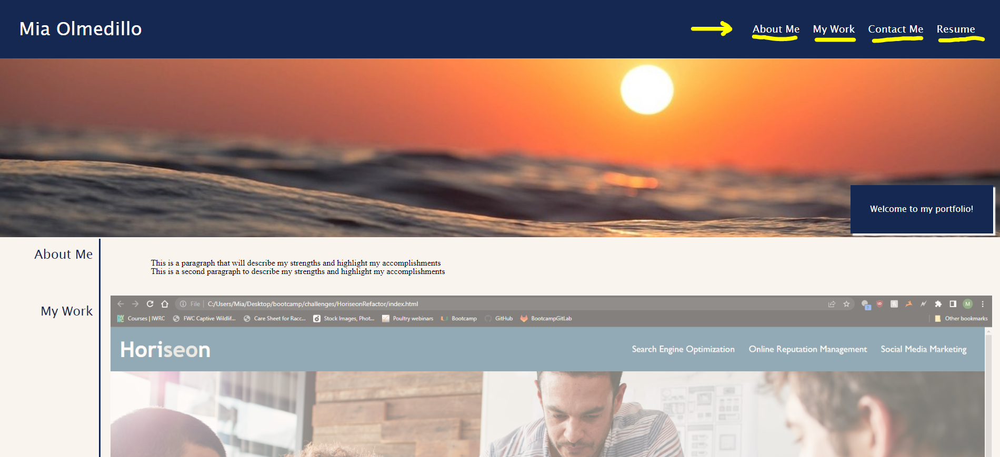
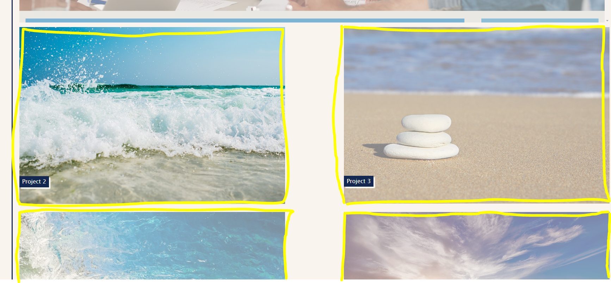

# MiasPortfolio

## Description

This website will showcase my work for potential employers to review. It will highlight my strengths and give insight to the thought processes behind my projects.I utilized HTML and advanced CSS to create this project from scratch. As this was my first website built from scratch, I learned a lot about various useful properties in CSS and how to structure my HTML effectively.  

## Table of Contents 

- [Installation](#installation)
- [Usage](#usage)
- [Credits](#credits)
- [License](#license)

## Installation

You can access this project by clicking the following link:

## Usage
The page can be navigated by using the links in the nav bar. 

Each project card is a clickable link that will lead to finished projects.

Use the links in the Contact me section to get in touch with me!

## Credits

[Coding Bootcamp](https://courses.bootcampspot.com)

[Professor Phil Loy](https://github.com/philliploy)

[Skillthrive NavBar Tutorial](https://youtu.be/PwWHL3RyQgk)

[w3 Schools](https://www.w3schools.com/)

[Pixabay for photos](https://pixabay.com/)

## License

[Please refer to the license on the repo](LICENSE)
